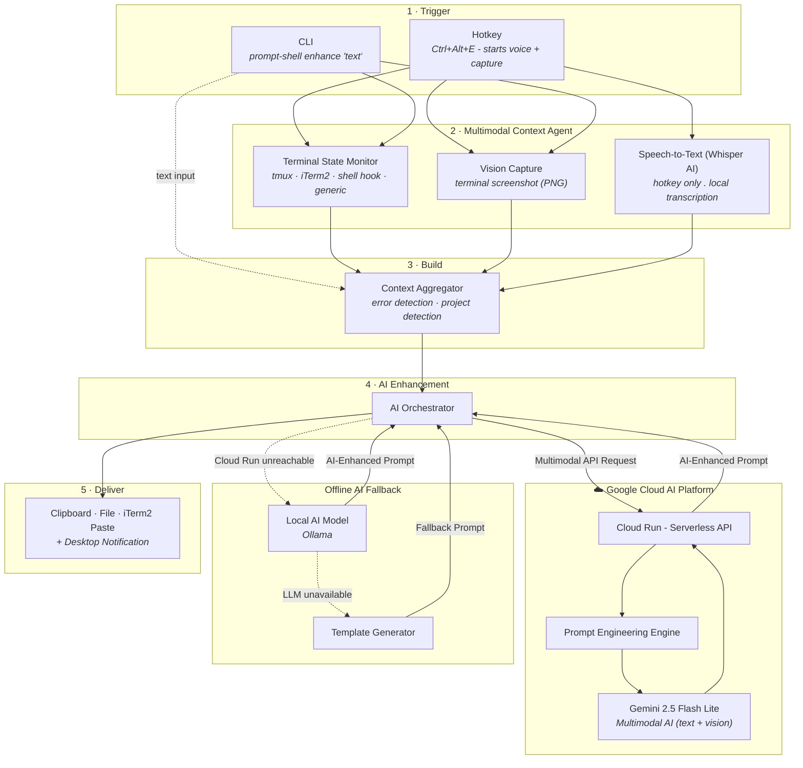
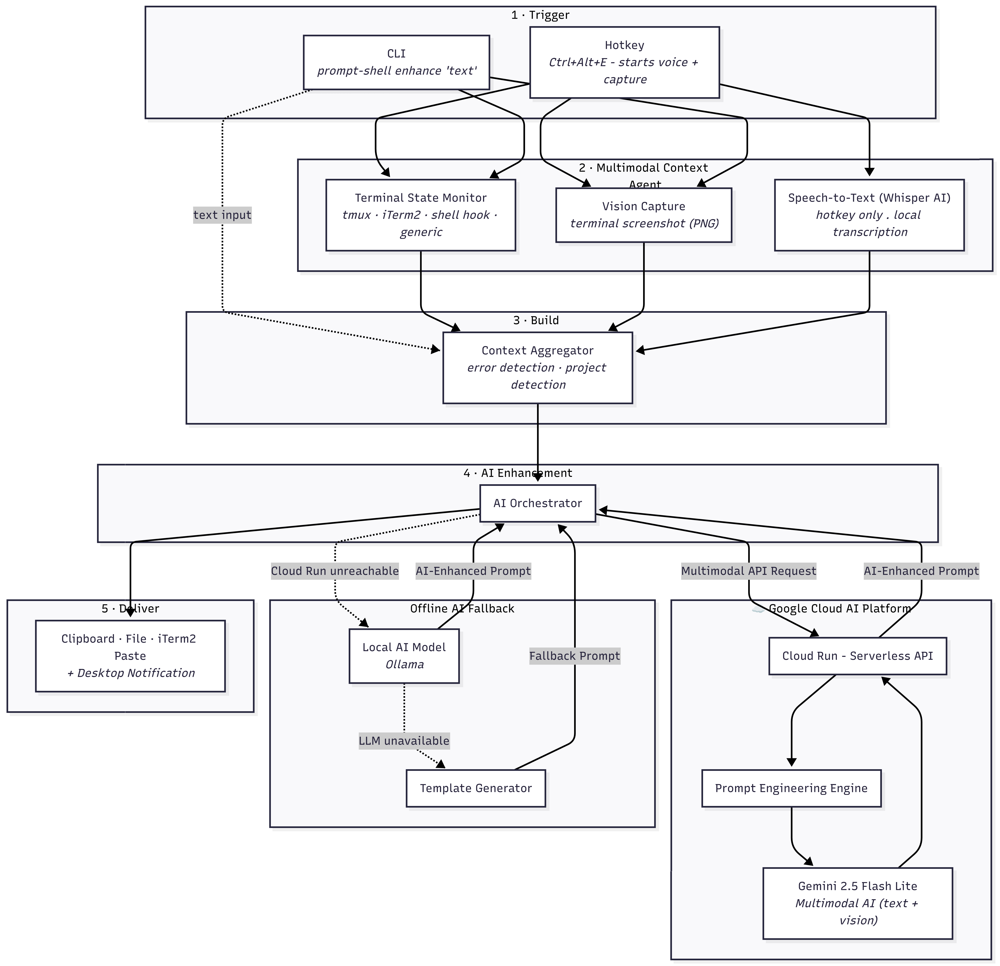

# PromptShell

[](https://github.com/VinnyBabuManjaly/PromptShell/actions/workflows/ci.yml)
[](https://github.com/VinnyBabuManjaly/PromptShell/actions/workflows/security.yml)
[](https://www.python.org/downloads/)
[](https://opensource.org/licenses/MIT)

> **"Stop paying for bad prompts. PromptShell gets it right the first time."**

A voice-activated, terminal-aware prompt enhancer for AI coding assistants.
Press a hotkey, speak a vague command like *"fix the error"* — PromptShell
captures your full terminal context (screen buffer, working directory, recent
commands, detected errors, git branch, screenshot) and rewrites it into a
precise, actionable prompt ready for ChatGPT, Copilot, Claude, Cursor, or any
other AI tool.

Enhancement is powered by **Gemini 2.5 Flash Lite** on **Google Cloud Run**,
using the **Google GenAI SDK** with multimodal (text + screenshot) input.

---

## Table of Contents

- [Quick Start](#quick-start)
- [Platform Support](#platform-support)
- [Why PromptShell](#why-promptshell)
- [How It Works](#how-it-works)
- [Architecture](#architecture)
- [Features](#features)
- [Configuration](#configuration)
- [Google Cloud Deployment](#google-cloud-deployment)
- [Development](#development)
- [Documentation](#documentation)
- [License](#license)

---

## Quick Start

### Prerequisites

- Python 3.11+
- [`uv`](https://docs.astral.sh/uv/getting-started/installation/) (recommended) or pip
- **macOS:** Xcode Command Line Tools (`xcode-select --install`)
- **Linux:** `portaudio19-dev` for microphone support (`sudo apt install portaudio19-dev`)
- A [Google AI Studio](https://aistudio.google.com) API key (free tier available)

### Install

```bash
pip install prompt-shell
```

### Set up

```bash
# Set your Gemini API key
export GEMINI_API_KEY=your_key_here

# Generate default config at ~/.prompt-shell/config.yaml
prompt-shell init

# Install shell hook for richer terminal state (zsh/bash/fish)
prompt-shell install-hook

# Verify it works with a one-shot enhance
prompt-shell enhance "fix the build error"
```

### Run the daemon

```bash
prompt-shell start
# Press Ctrl+Alt+E, speak your command, prompt lands in clipboard
```

---

## Platform Support

Requires **Python 3.11+**. Shells supported: **bash, zsh, fish**.

| Platform | Support | Notes |
|----------|:-------:|-------|
| **macOS 12+** | Full | Primary platform — all features available |
| **Linux Desktop (X11)** | Full | Requires `xclip` + `scrot` |
| **Linux Desktop (Wayland)** | Full | Requires `wl-copy` + `grim` |
| **Linux Headless / SSH** | Partial | No hotkey or clipboard; use `delivery.method: file` |
| **WSL2** | Full | Treated as Linux; clipboard works via interop |
| **Windows (native)** | Not supported | Use WSL2 |

### Feature availability by platform

| Feature | macOS | Linux Desktop | Headless/SSH | WSL2 |
|---------|:-----:|:-------------:|:------------:|:----:|
| Hotkey daemon | ✓ | ✓ | ✗ | ✓ |
| Screenshot capture | ✓ | ✓ | ✗ | ✓ |
| Voice + transcription | ✓ | ✓ | ✓ ¹ | ✓ |
| Apple Speech (local) | ✓ | ✗ | ✗ | ✗ |
| Clipboard delivery | ✓ | ✓ | ✗ | ✓ |
| File delivery | ✓ | ✓ | ✓ | ✓ |
| iTerm2 paste | ✓ | ✗ | ✗ | ✗ |
| Desktop notifications | ✓ | ✓ | ✗ | ✓ |
| Systemd service | ✗ | ✓ | ✓ | ✓ |
| Shell hooks (bash/zsh/fish) | ✓ | ✓ | ✓ | ✓ |

¹ Requires an audio device accessible over SSH.

### System dependencies

| Platform | Required packages |
|----------|-------------------|
| **macOS** | `brew install portaudio` · `xcode-select --install` |
| **Linux X11** | `sudo apt install portaudio19-dev xclip scrot libnotify-bin` |
| **Linux Wayland** | `sudo apt install portaudio19-dev wl-clipboard grim libnotify-bin` |
| **Linux Headless** | `sudo apt install portaudio19-dev` (voice only) |
| **iTerm2 integration** | `pip install "prompt-shell[iterm2]"` (macOS only) |

---

## Why PromptShell

Without PromptShell, the typical AI debugging loop looks like this:

1. Send vague command ("fix the error") → AI guesses wrong → **wasted round**
2. Paste error manually, forget the file path → AI still misses → **second wasted round**
3. Re-send with full context → finally get a useful answer → **3rd round is the first productive one**

Each round burns input + output tokens. PromptShell collapses 3 rounds into 1
by front-loading all the context the AI needs to answer correctly on the first attempt.

| | Without PromptShell | With PromptShell |
|---|---|---|
| Rounds to resolution | 3–5 | **1** |
| Tokens per debug task | ~3,000–5,000 | ~1,100 |
| Token reduction | baseline | **~60–75% fewer** |

The meta-prompt adds ~500 tokens of structured context — but eliminates the
back-and-forth entirely. At $15/million tokens, a developer doing 30 AI
interactions/day saves roughly **$540/year in API credits** while resolving
issues faster.

### Beyond API Credits

- **Zero context-switching** — no manual copy-paste of errors, paths, or branch names
- **Voice-first** — speak while looking at the terminal, hands stay on the keyboard
- **Multimodal ground truth** — screenshot catches UI dialogs and editor state the text buffer misses
- **Privacy by default** — Whisper transcription runs locally; voice never leaves the machine
- **Works with any AI** — output is plain text, paste into ChatGPT, Copilot, Claude, Cursor, or any tool
- **Offline capable** — falls back to Ollama when the cloud service is unreachable
- **No lock-in** — enhances whatever AI assistant you already use

---

## How It Works

**Input:** you say `"fix the error"`

**PromptShell captures:**
- Screen buffer: `error TS2345 in src/auth/middleware.ts:42`
- CWD: `~/project/backend`
- Last command: `npm run build` (exit code 1)
- Git branch: `feature/auth-refactor`
- Screenshot of the current terminal (PNG)

**Pipeline:** local client → Cloud Run → Gemini 2.5 Flash Lite (multimodal)

**Output delivered to clipboard:**
```
Fix the TypeScript compilation error TS2345 in src/auth/middleware.ts:42 —
Argument of type 'string' is not assignable to parameter of type 'AuthToken'.
The last command `npm run build` failed with exit code 1.
CWD: ~/project/backend, branch: feature/auth-refactor
```

**Result:** paste into any AI tool and get a precise answer on the first try.

---

## Architecture





PromptShell runs as a **multimodal AI pipeline** — text, voice, and vision feed
into a single agentic context capture step. The AI Orchestrator routes the
request to **Gemini Vision** on a **serverless Google Cloud backend**, with
graceful degradation to an **offline AI model** if the cloud is unreachable.
Everything except the Gemini call runs on-device.

Full system design: [docs/system_design.md](docs/system_design.md).

---

## Features

### Terminal Context Capture

Four pluggable backends, auto-detected at startup in priority order:

| Backend | Screen Buffer | CWD | Commands | Exit Code | Setup |
|---------|:---:|:---:|:---:|:---:|-------|
| **tmux** | Yes | Yes | Yes | Via hook | Be inside a tmux session |
| **iterm2** | Yes | Yes | Yes | Yes | `pip install .[iterm2]` (macOS only) |
| **shell_hook** | No | Yes | Yes | Yes | `prompt-shell install-hook` |
| **generic** | No | Yes | History | No | None (always available) |

- Polls every 2s in idle mode; captures immediately on hotkey trigger
- Detects project type from manifest files (`package.json`, `Cargo.toml`, `go.mod`, `pyproject.toml`)
- Reads git branch from the working directory
- Captures a screenshot of the active display concurrently with voice recording

### Error Detection

A regex engine scans the terminal output and extracts structured error info
(type, code, file, line, message) for 12+ error families:

- **Build errors** — TypeScript (`TS*`), ESLint, Rust (`cargo`), Go, Python
- **Runtime errors** — Node.js stack traces, Python tracebacks, segfaults
- **Test failures** — Jest, pytest, `cargo test`
- **Git conflicts** — merge conflict markers
- **Permission errors** — `EACCES`, sudo prompts
- **Network errors** — HTTP 4xx/5xx, `ECONNREFUSED`

### Voice Capture and Transcription

- Records from the microphone with energy-based VAD; stops on 1s of silence
- Three transcription backends (auto-fallback):
  - **faster-whisper** (local, offline, private) — default
  - **OpenAI Whisper API** (cloud, most accurate for jargon)
  - **Apple Speech Framework** (macOS native, lowest latency)

### Screenshot Context (Multimodal)

On each hotkey trigger, PromptShell captures a PNG screenshot of the current screen and attaches it to the Gemini request alongside the text context. This makes the call truly multimodal — Gemini Vision sees the exact terminal state, catching errors and UI details that the text buffer alone may miss.

- **macOS** — uses the built-in `screencapture` (no install needed)
- **Linux/GNOME** — uses `gnome-screenshot` (`sudo apt install gnome-screenshot`)
- **Linux/Wayland (wlroots)** — uses `grim` (`sudo apt install grim`)
- **Linux/X11** — uses `scrot` (`sudo apt install scrot`)

Disable in config if not needed:
```yaml
terminal:
  capture_screenshot: false
```

### Prompt Enhancement (Gemini on Cloud Run)

- Terminal context + voice transcript + screenshot sent to **Cloud Run** as a single request
- **Gemini 2.5 Flash Lite** receives text + PNG screenshot as multimodal input via the **Google GenAI SDK**
- Falls back to a local LLM or template if Cloud Run is unavailable

### Delivery

| Method | Description |
|--------|-------------|
| `clipboard` | Copies to system clipboard — `pbcopy` (macOS), `xclip` / `wl-copy` (Linux). Default. |
| `iterm_paste` | Pastes directly into the active iTerm2 session (macOS only). |
| `file` | Writes the prompt to `~/.prompt-shell/last_prompt.txt`. Useful for SSH/headless environments. |

**File delivery** — read or pipe the output from another terminal:

```bash
cat ~/.prompt-shell/last_prompt.txt
cat ~/.prompt-shell/last_prompt.txt | aichat
```

### Global Hotkeys

| Hotkey | Action |
|--------|--------|
| `Ctrl+Alt+E` | Voice capture → enhance → deliver to clipboard |
| `Ctrl+Alt+L` | Enhance last clipboard text with terminal context (no voice) |
| `Ctrl+Alt+R` | Re-enhance last prompt with updated terminal context |
| `Esc` | Cancel ongoing voice capture |

> Customize hotkeys in `~/.prompt-shell/config.yaml` under the `hotkeys:` key.
> Avoid `Ctrl+Shift+E` — reserved by GNOME/GTK for Unicode input.

### CLI Reference

```
prompt-shell start             # Start the daemon with global hotkeys
prompt-shell enhance "..."     # One-shot: enhance a text prompt
prompt-shell context           # Print current terminal context (debug)
prompt-shell install-hook      # Install shell hook (zsh/bash/fish)
prompt-shell install-service   # Install as a systemd user service (Linux)
prompt-shell init              # Generate default config
```

### Running as a Service (Linux)

Install PromptShell as a systemd user service so it starts automatically on login:

```bash
prompt-shell install-service
echo "GEMINI_API_KEY=your_key_here" >> ~/.prompt-shell/env
```

```bash
systemctl --user status prompt-shell    # Check status
systemctl --user restart prompt-shell   # Restart
systemctl --user stop prompt-shell      # Stop
systemctl --user disable prompt-shell   # Disable autostart
journalctl --user -u prompt-shell -f    # Follow logs
```

### Security

- Screen buffer is held in memory only — never persisted to disk
- All transcription is local by default (faster-whisper); cloud APIs are opt-in
- `GEMINI_API_KEY` is read from the environment variable only; never stored in config files
- Environment variable substitution (`${VAR}`) is supported in config
- Configurable redaction patterns for secrets in terminal output

---

## Configuration

All settings live in `~/.prompt-shell/config.yaml`. Generate the default:

```bash
prompt-shell init
```

```yaml
terminal:
  backend: auto            # auto | tmux | iterm2 | shell_hook | generic
  capture_screenshot: true

voice:
  engine: whisper_local    # whisper_local | whisper_api | apple_speech
  whisper_model: base.en

llm:
  provider: gemini
  model: gemini-2.5-flash-lite
  api_key: ${GEMINI_API_KEY}
  cloud_run_url: ${CLOUD_RUN_URL}

delivery:
  method: clipboard        # clipboard | iterm_paste | file
  show_notification: true
```

See [`config.example.yaml`](config.example.yaml) for all available options with annotations.

---

## Google Cloud Deployment

The enhancement service runs on **Cloud Run** with **Gemini 2.5 Flash Lite** via the
**Google GenAI SDK**. It scales to zero when idle — cost is effectively **$0/month**
at personal/demo scale.

### Automatic deployment (recommended)

Pushing a version tag triggers the full release pipeline:

```bash
# 1. Bump version in pyproject.toml, then commit
git commit -m "chore: bump version to 0.2.0"

# 2. Tag and push — pipeline handles the rest
git tag v0.2.0
git push origin v0.2.0
```

Pipeline: `validate → test → build → publish-pypi → deploy-cloud-run / github-release / docker`

Cloud Run deploys after PyPI publish, keeping the service and package version in sync. Each image is tagged with the version (e.g. `v0.2.0`) for easy rollback.

### Required GitHub secrets

Add these to **Settings → Secrets and variables → Actions** before your first release:

| Secret | Value |
|--------|-------|
| `GCP_PROJECT_ID` | Your GCP project ID |
| `GCP_SA_KEY` | Service account JSON key, base64-encoded |
| `GEMINI_API_KEY` | Google AI Studio API key |

See [docs/deployment.md](docs/deployment.md) for step-by-step GCP setup.

### First-time / local deploy

```bash
export PROJECT_ID=your-gcp-project-id
export GEMINI_API_KEY=your-gemini-api-key
bash deploy.sh
```

### Manual re-deploy (without a new release)

To redeploy without bumping the version — e.g. after a secret rotation:

**GitHub → Actions → Deploy to Cloud Run (Manual) → Run workflow**

### Verify the deployment

```bash
curl $CLOUD_RUN_URL/health
# {"status":"ok"}

curl -X POST $CLOUD_RUN_URL/enhance \
  -H "Content-Type: application/json" \
  -d '{"voice_transcript": "fix the build error", "cwd": "/app"}'
```

### Rollback

```bash
gcloud run deploy prompt-shell-enhancer \
  --image gcr.io/$PROJECT_ID/prompt-shell-enhancer:v0.1.0 \
  --platform managed --region us-central1
```

### Cost

**~$0/month** at demo/personal scale. Cloud Run scales to zero between requests.
Gemini 2.5 Flash Lite free tier covers 1,500 requests/day.
See [docs/deployment.md](docs/deployment.md) for a full cost breakdown.

---

## Development

```bash
git clone https://github.com/VinnyBabuManjaly/PromptShell.git
cd PromptShell
uv sync --extra dev

# Lint and format
uv run ruff check src/ tests/
uv run ruff format src/ tests/

# Run tests
uv run pytest tests/ -v --tb=short
```

See [AGENTS.md](AGENTS.md) for the full contribution guide, branch conventions,
and cross-platform notes.

---

## Troubleshooting

| Symptom | Fix |
|---------|-----|
| No audio captured | Check microphone permissions (macOS: System Settings → Privacy → Microphone) |
| `portaudio` not found | `sudo apt install portaudio19-dev` (Linux) |
| Hotkey not triggering | Run `prompt-shell start` with `sudo` on Linux (required for global keyboard events) |
| Cloud Run returns 404 | Model name mismatch — verify `gemini-2.5-flash-lite` in your config and redeploy |
| `shell_hook` not working | Run `prompt-shell install-hook` then restart your shell |
| Clipboard empty after enhance | Check `delivery.method: clipboard` in config; try `delivery.method: file` as a fallback |

---

## Documentation

| Document | Description |
|----------|-------------|
| [AGENTS.md](AGENTS.md) | Development guide — prerequisites, build/test/lint, branch conventions, contribution workflow |
| [docs/system_design.md](docs/system_design.md) | Full system design — Mermaid diagrams for architecture, pipeline sequence, data models, CI/CD |
| [docs/architecture.md](docs/architecture.md) | ASCII architecture diagrams, module layout, data flow, error handling strategy, performance budget |
| [docs/deployment.md](docs/deployment.md) | End-to-end deployment guide — GCP setup, GitHub secrets, release pipeline, rollback, cost breakdown |
| [docs/spec.md](docs/spec.md) | Technical specification — problem statement, requirements, API design, data models |
| [docs/article.md](docs/article.md) | Published article — "I Built a Voice-Activated Prompt Enhancer That Reads Your Terminal" |
| [config.example.yaml](config.example.yaml) | Annotated configuration template with all available options |

---

## License

MIT
