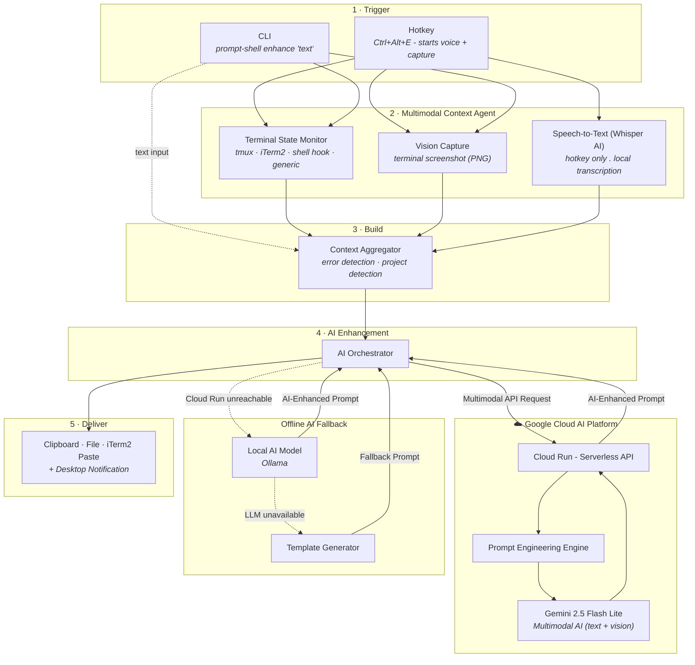
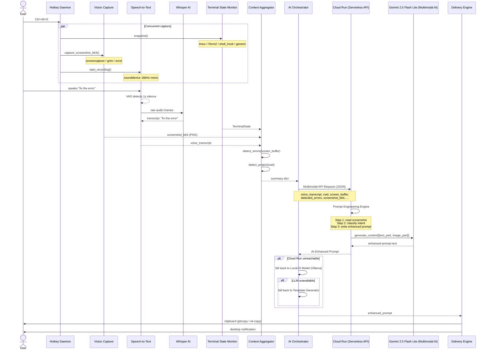
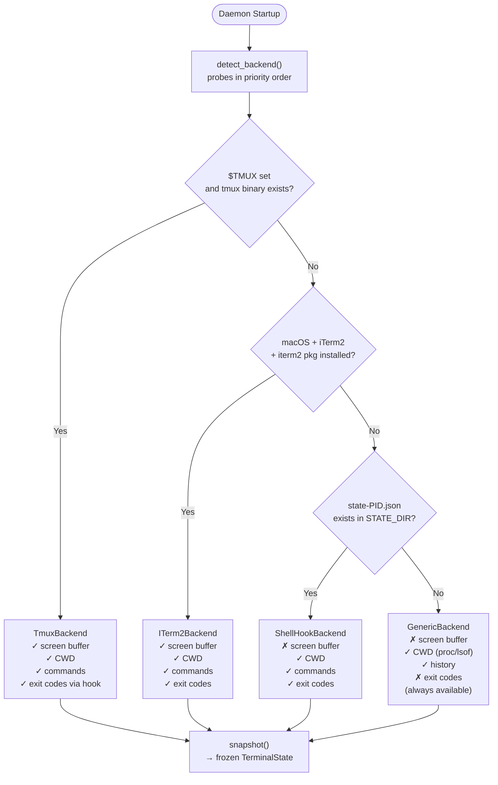
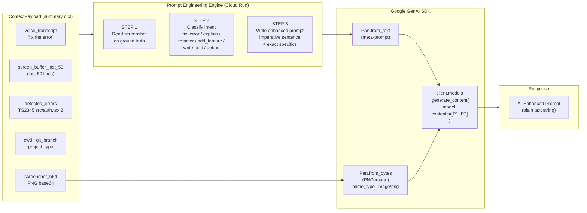
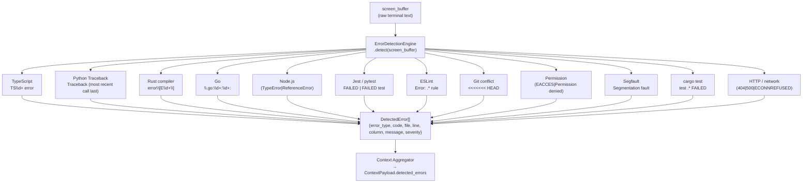
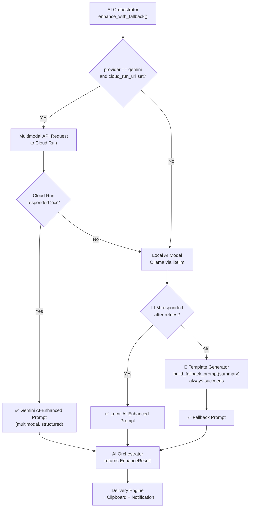
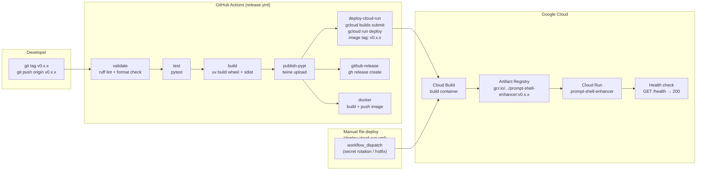
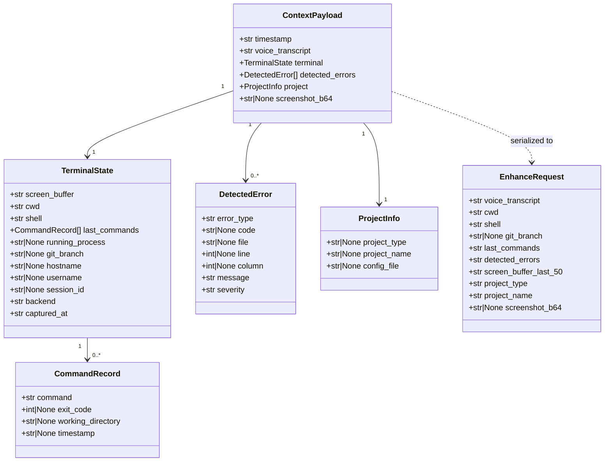
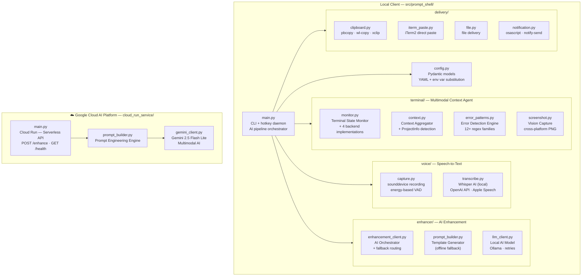

# PromptShell — System Design

## 1. High-Level Architecture

---

## 2. End-to-End Pipeline Sequence

---

## 3. Terminal Backend Auto-Detection

---

## 4. Multimodal Gemini Request Construction

---

## 5. Error Detection Engine

---

## 6. Graceful Degradation Chain

---

## 7. CI/CD and Deployment Pipeline

---

## 8. Data Model

---

## 9. Component Responsibility Map

